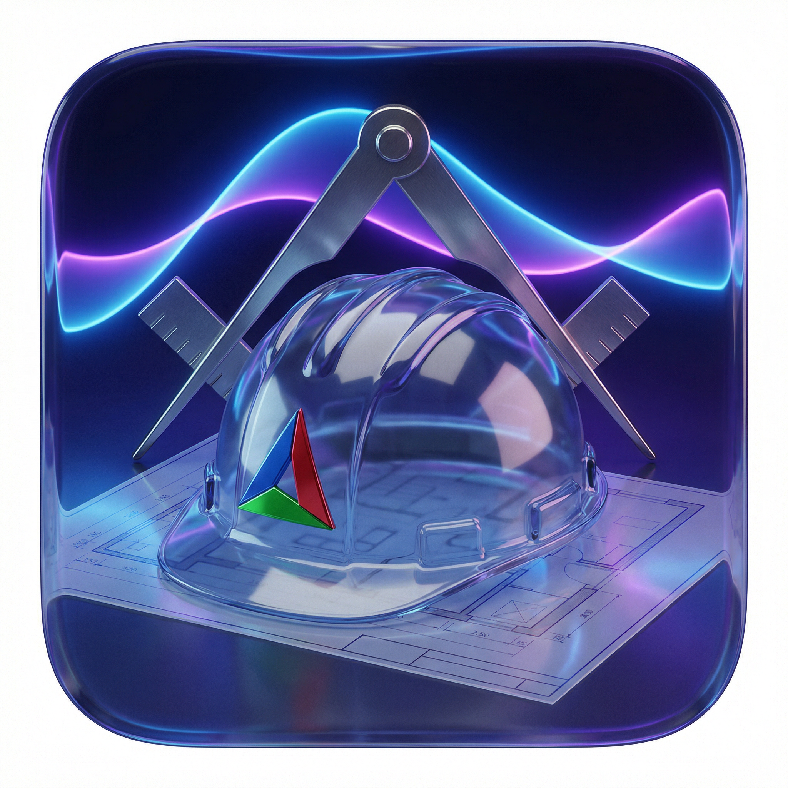

# cmake_template

<p align="center">
  
</p>

<p align="center">
  <a href="https://github.com/e-gleba/cmake_template/blob/main/license.md"></a>
  <a href="https://github.com/e-gleba/cmake_template/actions/workflows/cmake_multi_platform.yml"></a>
  <a href="https://github.com/e-gleba/cmake_template/actions/workflows/steam_runtime.yml"></a>
  <a href="https://github.com/e-gleba/cmake_template/releases"></a>
  <a href="https://isocpp.org/"></a>
  <a href="https://cmake.org"></a>
</p>

<p align="center">
  <a href="https://github.com/e-gleba/cmake_template/actions/workflows/release.yml"></a>
  <a href="https://github.com/e-gleba/cmake_template/actions/workflows/publish-docker.yml"></a>
  <a href="https://github.com/e-gleba/cmake_template/actions/workflows/cmake_multi_platform.yml"></a>
  <a href="https://github.com/e-gleba/cmake_template/actions/workflows/renovate.yml"></a>
</p>

<p align="center">
  <b>The only CMake template with Android NDK, Linux→Windows cross-compilation, WebAssembly, and Gradle Managed Devices — out of the box.</b>
</p>

<p align="center">
  <a href="https://github.com/e-gleba/cmake_template/generate"></a>
</p>

---

Production-ready C++ template for cross-platform projects. Targets C++23/26. Ninja Multi-Config, CPM, clang-tidy, clang-format, pre-commit hooks. Packages with CPack. Tests with doctest — instrumented on Android via Gradle Managed Devices, run under Node.js on WebAssembly. Zero friction from clone to package on **Linux, Windows, Android, macOS, and WebAssembly**.

```bash
# Desktop — full pipeline in one command
cmake --workflow --preset=linux_gcc_x86_64_release_package

# Android — configure + build for arm64
cmake --workflow --preset=android_clang_aarch64_release_build

# Linux → Windows ARM64 — cross-compile + package
cmake --workflow --preset=windows_llvm_mingw_aarch64_release_package
```

**Release:** click [▶ run release](https://github.com/e-gleba/cmake_template/actions/workflows/release.yml), type `v1.2.3` and next CMake version (`1.2.4`). Builds every platform, optionally pushes GHCR images, tags, attaches CPack/APK artifacts, then opens+merges a PR bumping `project(VERSION)` on main.

---

## Why this template?

| You need | Most templates | This template |
| --- | --- | --- |
| **Android NDK** | ❌ Not even mentioned | ✅ 4 presets (arm64, arm32, x64, x86), API 24, `c++_shared`, Prefab |
| **Android instrumentation tests** | ❌ | ✅ `AndroidJUnitRunner`, Gradle Managed Devices (Pixel 6 ATD), doctest JNI bridge, [#23 native GTest strategy](https://github.com/e-gleba/cmake_template/issues/23) |
| **Linux → Windows cross-compile** | ❌ | ✅ llvm-mingw toolchain: x86_64, i686, aarch64 |
| **WebAssembly** | ❌ | ✅ Emscripten preset with zero-setup SDK bootstrap, SDL3 + ImGui + OpenGL web demo, doctest under Node.js |
| **Steam / Steam Deck** | ❌ Not even mentioned | ✅ steamrt4 SDK preset, ABI gate, platform smoke test, static-CRT Windows builds, SteamPipe deploy templates |
| **CMake Presets** | Basic or none | ✅ 10+ configure presets, 15+ build presets, workflow presets, schema v12 |
| **Packaging** | ❌ | ✅ CPack: tar.gz, zip, txz per platform |
| **Reproducible CI** | Manual Docker | ✅ Docker images + GitHub Actions matrix |
| **One-click release** | ❌ | ✅ `workflow_dispatch` + GHCR + CPack/APK attach |
| **Code quality** | Maybe clang-format | ✅ clang-tidy, clang-format, `.cmake-format.yaml`, pre-commit hooks, `.editorconfig` |
| **C++ Standard** | 17 | ✅ **23 / 26** |

---

## Quick Start

### 1. Create your repo from this template

<p align="center">
  <a href="https://github.com/e-gleba/cmake_template/generate"><b>Click here: Use this template → Create new repository</b></a>
</p>

Then clone your new repo:

```bash
git clone https://github.com/YOUR_USER/YOUR_PROJECT
cd YOUR_PROJECT
```

### 2. Build and test (desktop)

```bash
# GCC — full pipeline
cmake --workflow --preset=linux_gcc_x86_64_release_package

# Or step by step:
cmake --preset=linux_gcc_x86_64
cmake --build --preset=linux_gcc_x86_64_release
ctest --preset=linux_gcc_x86_64_release

# Clang
cmake --workflow --preset=linux_clang_x86_64_release_package

# MSVC (Windows only)
cmake --workflow --preset=windows_msvc_x86_64_release_package
```

### 3. Cross-compile for Android

```bash
# Requires: ANDROID_NDK_HOME or ANDROID_HOME set
cmake --preset=android_clang_aarch64
cmake --build --preset=android_clang_aarch64_release

# Run instrumented tests on device/emulator
cd android-project
./gradlew pixel_6_aosp_atd_30DebugAndroidTest
./gradlew connectedCheck
```

### 4. Cross-compile for Windows (from Linux)

```bash
# Requires: llvm-mingw installed
cmake --workflow --preset=windows_llvm_mingw_x86_64_release_package
# → build/windows_llvm_mingw_x86_64/package/cxx_project-*.zip
```

### 5. WebAssembly (zero setup)

```bash
# No emsdk install needed — the toolchain bootstraps a pinned SDK into .emsdk/
cmake --workflow --preset=web_emscripten_wasm32_release_test
# → build/web_emscripten_wasm32/src/emscripten/Release/web_app.{html,js,wasm}
```

---

## Platform Matrix

| Platform | Preset | Generator | Test runner | Package |
| --- | --- | --- | --- | --- |
| **Linux (native)** | `linux_gcc_x86_64`, `linux_clang_x86_64` | Ninja Multi-Config | `ctest` | `.tar.gz` |
| **Windows (native)** | `windows_msvc_x86_64` | Visual Studio 17 2022 | `ctest` | `.zip` |
| **Windows (cross)** | `windows_llvm_mingw_x86_64`, `windows_llvm_mingw_x86`, `windows_llvm_mingw_aarch64` | Ninja Multi-Config | — (cross-compiled) | `.tar.xz` |
| **Android arm64** | `android_clang_aarch64` | Ninja Multi-Config | `gradlew connectedCheck` | — |
| **Android arm32** | `android_clang_armv7` | Ninja Multi-Config | `gradlew connectedCheck` | — |
| **Android x64** | `android_clang_x86_64` | Ninja Multi-Config | `gradlew connectedCheck` | — |
| **Android x86** | `android_clang_x86` | Ninja Multi-Config | `gradlew connectedCheck` | — |
| **macOS** | `clang` (native) | Ninja Multi-Config | `ctest` | `.tar.gz` |
| **iOS / macOS Xcode** | [planned #20](https://github.com/e-gleba/cmake_template/issues/20) | Xcode | `xctest` / `xcodebuild test` | — |
| **WebAssembly** | `web_emscripten_wasm32` | Ninja Multi-Config | `ctest` via Node.js | `.html` + `.js` + `.wasm` |
| **Steam Runtime 4** | `linux_steamrt4_x86_64` | Ninja Multi-Config | `ctest` + ABI gate + platform smoke test | `.zip` (SteamPipe-ready) |
| **Windows (Steam, static CRT)** | `windows_msvc_steam_x86_64`, `windows_llvm_mingw_steam_x86_64` | VS 17 2022 / Ninja Multi-Config | `ctest` + PE import gate | `.zip` (SteamPipe-ready) |

---

## Comparison: Competitive Landscape

| Feature | **cmake_template** | [cpp-best-practices](https://github.com/cpp-best-practices/cmake_template) | [modern-cpp-template](https://github.com/filipdutescu/modern-cpp-template) | [cmake-init](https://github.com/cginternals/cmake-init) |
| --- | --- | --- | --- | --- |
| **C++ Standard** | **23 / 26** | 17 / 20 | 17 | 11+ |
| **CMake Presets** | ✅ 10+ with workflows | ❌ | ❌ | ❌ |
| **Android NDK** | ✅ 4 ABI | ❌ | ❌ | ❌ |
| **Android instrumented tests** | ✅ GMD + doctest JNI | ❌ | ❌ | ❌ |
| **Linux → Windows cross** | ✅ llvm-mingw (3 arch) | ❌ | ❌ | ❌ |
| **WebAssembly** | ✅ Emscripten (SDL3 + ImGui + OpenGL demo) | ✅ + Pages deploy | ❌ | ❌ |
| **Steam Runtime / Deck** | ✅ steamrt4 + static CRT + ABI CI | ❌ | ❌ | ❌ |
| **Docker / CI** | ✅ + Actions matrix | ✅ Docker + Actions | ✅ GitHub Actions | ✅ |
| **CPack packaging** | ✅ tar.gz / zip / txz | ❌ | ❌ | ❌ |
| **Sanitizers** | ❌ [#9](https://github.com/e-gleba/cmake_template/issues/9) | ✅ ASan/UBSan | ✅ | ❌ |
| **Fuzz testing** | ❌ | ✅ libFuzzer | ❌ | ❌ |
| **Code coverage** | ❌ [#10](https://github.com/e-gleba/cmake_template/issues/10) | ✅ codecov | ✅ codecov | ❌ |
| **macOS/iOS (Xcode)** | ❌ [#20](https://github.com/e-gleba/cmake_template/issues/20) | Limited | ❌ | ❌ |
| **vcpkg** | ❌ [#3](https://github.com/e-gleba/cmake_template/issues/3) | ❌ | ❌ | ❌ |
| **GitHub Stars** | *you are here* | 1,700+ | 1,900+ | 900+ |
| **Age** | ~1 year | 3 years | 5 years | 11 years |
| **License** | MIT | Unlicense | Unlicense | MIT |

---

## Documentation

| Document | What it covers |
| --- | --- |
| [Presets & Platforms](docs/presets.md) | All CMake presets, platform support, cross-compilation details |
| [Architecture](docs/architecture.md) | CMake design decisions, directory structure, `PROJECT_IS_TOP_LEVEL` pattern |
| [Docker Guide](docs/docker.md) | Docker images, GHCR publish, one-click release |
| [Contributing](docs/contributing.md) | How to contribute, code style, pre-commit setup |
| [References](docs/references.md) | Curated external links (do NOT bloat README) |
| [Steam & Steam Deck](cmake/steampipe) | steamrt4 presets, ABI/PE/loader gates, CMake-generated SteamPipe VDFs |
| [Issue: Android native testing strategy](https://github.com/e-gleba/cmake_template/issues/23) | GTest vs doctest, Activity lifecycle, XCTest, CI/CD — research-backed |

---

## Consulting

I help teams reduce C++ build friction and ship cross-platform products faster.

**Services:**

- CMake architecture audits and modernisation
- Android NDK toolchain setup and Gradle integration
- CI/CD pipeline design for C++ (GitHub Actions, GitLab CI, Docker)
- Cross-compilation pipelines (Linux→Windows, Linux→Android, macOS→iOS)
- CPack packaging and distribution
- Team onboarding workshops

**Why work with me:**

- This template is the public portfolio — it demonstrates real engineering depth in CMake, NDK, cross-compilation, and CI
- I focus exclusively on **build engineering** — not general software consulting
- Every engagement starts with a concrete deliverable, not a roadmap document

<p align="center">

| | |
| --- | --- |
| 🌐 **Website** | [e-gleba.github.io](https://e-gleba.github.io) |
| 📧 **Email** | [i@egleba.ru](mailto:i@egleba.ru) — fastest response |
| 💬 **Discussions** | [GitHub Discussions](https://github.com/e-gleba/cmake_template/discussions) |
| 💼 **Rate** | Up to $150/hr depending on scope |
| 📍 **Location** | Remote-first, worldwide |

</p>

---

<div align="center">
<sub>MIT — use it for anything: commercial products, internal tools, or as a base for your own template · <a href="license.md">license.md</a></sub>
</div>
